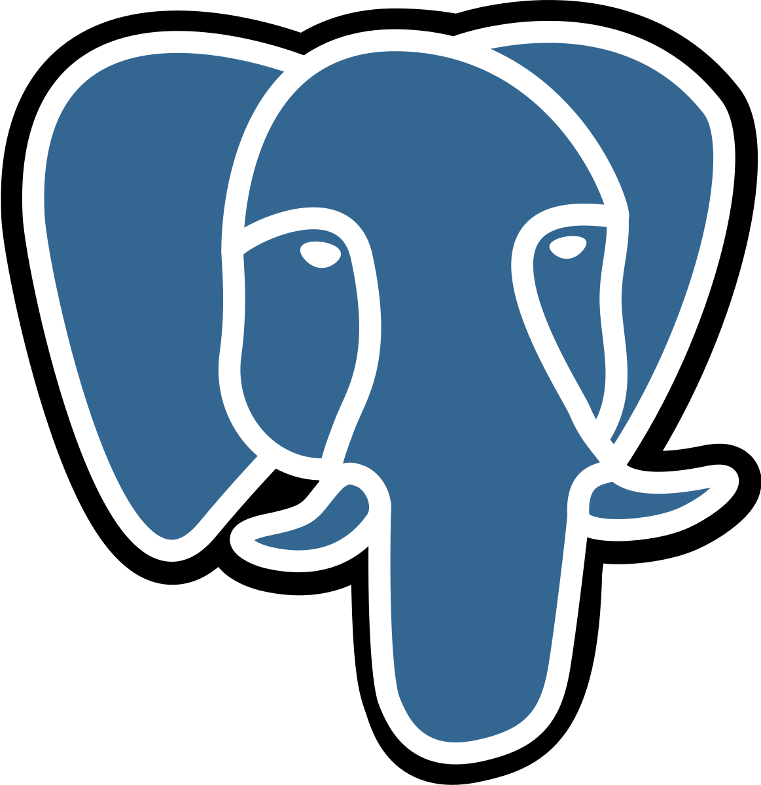

<!-- ========================================================= -->
<!--                  R U P A M   M O N D A L                  -->
<!-- ========================================================= -->

<!-- Animated Wave Banner -->

  

<!-- Typing Intro -->

  

<!-- Neon Stat Badges -->

  
  
  
  

---

<!-- ===================== ABOUT ME ===================== -->

  

  

    

      <table width="100%" cellpadding="0" cellspacing="0">
        <tr>
          <td valign="top" width="55%" style="padding-right:24px;">
            
I'm <strong>Rupam Mondal</strong>, a data-focused engineer turning messy datasets into products that ship. I care about dependable analytics, ML-first applications, and automation that scales with teams.

            
<strong>Focus:</strong> production-ready data pipelines, ML systems, and AI-powered copilots.

            
<strong>Looking for:</strong> data/ML/AI engineering roles where I can deliver end-to-end analytics workflows and machine-learning products.

          </td>
          <td valign="top" width="45%">
            <table width="100%" border="1" bordercolor="#27ffd9" cellpadding="10" cellspacing="0" style="background-color:#050d24;border-radius:14px;">
              <tr bgcolor="#0d1633">
                <th align="left" style="color:#27ffd9;">Education</th>
                <th align="left" style="color:#27ffd9;">Highlights</th>
              </tr>
              <tr bgcolor="#0b142b">
                <td style="color:#f4f8ff;">B.Tech CSE (AI & ML)</td>
                <td style="color:#9bb6ff;">University of Engineering and Management, Kolkata GPA 8.64 (till 6th sem) • 2022‑2026</td>
              </tr>
              <tr bgcolor="#0b142b">
                <td style="color:#f4f8ff;">Higher Secondary</td>
                <td style="color:#9bb6ff;">Sree Ramakrishna Sishutirtha High School Science • 81.8% • 2021‑2022</td>
              </tr>
              <tr bgcolor="#0b142b">
                <td style="color:#f4f8ff;">Secondary</td>
                <td style="color:#9bb6ff;">Patha Bhavan Dankuni 81.5% • 2020</td>
              </tr>
            </table>
          </td>
        </tr>
      </table>
    

  

---

###  **Programming & Scripting**

<table align="center" width="92%" border="1" bordercolor="#27ffd9" cellpadding="12" cellspacing="0" style="background-color:#050d24;">
  <tr bgcolor="#0d1633">
    <th align="left" style="color:#27ffd9;">Language</th>
    <th align="left" style="color:#27ffd9;">Proficiency</th>
  </tr>
  <tr bgcolor="#0b142b">
    <td>
      <table>
        <tr>
          <td width="70"></td>
          <td><strong style="color:#f4f8ff;">Python</strong> DSA ,Primary scripting, analytics & ML</td>
        </tr>
      </table>
    </td>
    <td>
       90%
    </td>
  </tr>
  <tr bgcolor="#0b142b">
    <td>
      <table>
        <tr>
          <td width="70"></td>
          <td><strong style="color:#f4f8ff;">R</strong> Statistical modelling </td>
        </tr>
      </table>
    </td>
    <td>
       60%
    </td>
  </tr>
  <tr bgcolor="#0b142b">
    <td>
      <table>
        <tr>
          <td width="70"></td>
          <td><strong style="color:#f4f8ff;">C</strong> Foundational programming concepts</td>
        </tr>
      </table>
    </td>
    <td>
       60%
    </td>
  </tr>
  <tr bgcolor="#0b142b">
    <td>
      <table>
        <tr>
          <td width="70"></td>
          <td><strong style="color:#f4f8ff;">Java</strong> OOP fundamentals</td>
        </tr>
      </table>
    </td>
    <td>
       30%
    </td>
  </tr>
</table>

---

###  **Databases**

<table align="center" width="92%" border="1" bordercolor="#27ffd9" cellpadding="12" cellspacing="0" style="background-color:#050d24;">
  <tr bgcolor="#0d1633">
    <th align="left" style="color:#27ffd9;">Database</th>
    <th align="left" style="color:#27ffd9;">Proficiency</th>
  </tr>
  <tr bgcolor="#0b142b">
    <td>
      <table>
        <tr>
          <td width="70"></td>
          <td><strong style="color:#f4f8ff;">SQL Server</strong> T-SQL, stored procs, performance tuning</td>
        </tr>
      </table>
    </td>
    <td>
       90%
    </td>
  </tr>
  <tr bgcolor="#0b142b">
    <td>
      <table>
        <tr>
          <td width="70"></td>
          <td><strong style="color:#f4f8ff;">Postgres</strong> Schema design & query optimization</td>
        </tr>
      </table>
    </td>
    <td>
       60%
    </td>
  </tr>
  <tr bgcolor="#0b142b">
    <td>
      <table>
        <tr>
          <td width="70"></td>
          <td><strong style="color:#f4f8ff;">MongoDB</strong> Document modeling & aggregation</td>
        </tr>
      </table>
    </td>
    <td>
       60%
    </td>
  </tr>
</table>

###  **Data Engineering and Warehousing**

<table align="center" width="92%" border="1" bordercolor="#27ffd9" cellpadding="12" cellspacing="0" style="background-color:#050d24;">
  <tr bgcolor="#0d1633">
    <th align="left" style="color:#27ffd9;">Platform</th>
    <th align="left" style="color:#27ffd9;">Proficiency</th>
  </tr>
  <tr bgcolor="#0b142b">
    <td>
      <table>
        <tr>
          <td width="70"></td>
          <td><strong style="color:#f4f8ff;">Databricks</strong> Delta pipelines & collaborative notebooks</td>
        </tr>
      </table>
    </td>
    <td>
       60%
    </td>
  </tr>
  <tr bgcolor="#0b142b">
    <td>
      <table>
        <tr>
          <td width="70"></td>
          <td><strong style="color:#f4f8ff;">Azure Data Factory</strong> Ingestion orchestration & mapping data flows</td>
        </tr>
      </table>
    </td>
    <td>
       60%
    </td>
  </tr>
  <tr bgcolor="#0b142b">
    <td>
      <table>
        <tr>
          <td width="70"></td>
          <td><strong style="color:#f4f8ff;">dbt</strong> Modular SQL transforms & testing</td>
        </tr>
      </table>
    </td>
    <td>
       60%
    </td>
  </tr>
  <tr bgcolor="#0b142b">
    <td>
      <table>
        <tr>
          <td width="70"></td>
          <td><strong style="color:#f4f8ff;">Snowflake</strong> Warehouse modeling & usage monitoring</td>
        </tr>
      </table>
    </td>
    <td>
       60%
    </td>
  </tr>
  <tr bgcolor="#0b142b">
    <td>
      <table>
        <tr>
          <td width="70"></td>
          <td><strong style="color:#f4f8ff;">Delta Lake</strong> ACID tables & time travel patterns</td>
        </tr>
      </table>
    </td>
    <td>
       30%
    </td>
  </tr>
</table>

###  **Data Analysis and Business Intelligence**

<table align="center" width="92%" border="1" bordercolor="#27ffd9" cellpadding="12" cellspacing="0" style="background-color:#050d24;">
  <tr bgcolor="#0d1633">
    <th align="left" style="color:#27ffd9;">Tool</th>
    <th align="left" style="color:#27ffd9;">Proficiency</th>
  </tr>
  <tr bgcolor="#0b142b">
    <td>
      <table>
        <tr>
          <td width="70"></td>
          <td><strong style="color:#f4f8ff;">Tableau</strong> Interactive KPI dashboards & storytelling</td>
        </tr>
      </table>
    </td>
    <td>
       90%
    </td>
  </tr>
  <tr bgcolor="#0b142b">
    <td>
      <table>
        <tr>
          <td width="70"></td>
          <td><strong style="color:#f4f8ff;">SQL for Analytics</strong> Complex joins, window functions, CTEs</td>
        </tr>
      </table>
    </td>
    <td>
       90%
    </td>
  </tr>
  <tr bgcolor="#0b142b">
    <td>
      <table>
        <tr>
          <td width="70"></td>
          <td><strong style="color:#f4f8ff;">Pandas</strong> EDA, feature engineering & time-series</td>
        </tr>
      </table>
    </td>
    <td>
       90%
    </td>
  </tr>
  <tr bgcolor="#0b142b">
    <td>
      <table>
        <tr>
          <td width="70"></td>
          <td><strong style="color:#f4f8ff;">NumPy</strong> Vectorized computation & optimizations</td>
        </tr>
      </table>
    </td>
    <td>
       90%
    </td>
  </tr>
  <tr bgcolor="#0b142b">
    <td>
      <table>
        <tr>
          <td width="70"></td>
          <td><strong style="color:#f4f8ff;">Matplotlib / Seaborn</strong> Custom visual narratives & analytics</td>
        </tr>
      </table>
    </td>
    <td>
       90%
    </td>
  </tr>
  <tr bgcolor="#0b142b">
    <td>
      <table>
        <tr>
          <td width="70"></td>
          <td><strong style="color:#f4f8ff;">Excel / Power Query</strong> Dashboards, pivots & automation</td>
        </tr>
      </table>
    </td>
    <td>
       60%
    </td>
  </tr>
</table>

###  **Machine Learning & AI**

<table align="center" width="92%" border="1" bordercolor="#27ffd9" cellpadding="12" cellspacing="0" style="background-color:#050d24;">
  <tr bgcolor="#0d1633">
    <th align="left" style="color:#27ffd9;">Framework | Workflow</th>
    <th align="left" style="color:#27ffd9;">Proficiency</th>
  </tr>
  <tr bgcolor="#0b142b">
    <td>
      <table>
        <tr>
          <td width="70"></td>
          <td><strong style="color:#f4f8ff;">Scikit-learn</strong> Model development, tuning & evaluation</td>
        </tr>
      </table>
    </td>
    <td>
       90%
    </td>
  </tr>
  <tr bgcolor="#0b142b">
    <td>
      <table>
        <tr>
          <td width="70"></td>
          <td><strong style="color:#f4f8ff;">PyTorch</strong> Prototype deep nets & experimentation</td>
        </tr>
      </table>
    </td>
    <td>
       60%
    </td>
  </tr>
  <tr bgcolor="#0b142b">
    <td>
      <table>
        <tr>
          <td width="70"></td>
          <td><strong style="color:#f4f8ff;">LangChain</strong> LLM chaining, tools & retrieval</td>
        </tr>
      </table>
    </td>
    <td>
       60%
    </td>
  </tr>
  <tr bgcolor="#0b142b">
    <td>
      <table>
        <tr>
          <td width="70"></td>
          <td><strong style="color:#f4f8ff;">Hugging Face Hub</strong> Model hub, inference API integration</td>
        </tr>
      </table>
    </td>
    <td>
       30%
    </td>
  </tr>
  <tr bgcolor="#0b142b">
    <td>
      <table>
        <tr>
          <td width="70"></td>
          <td><strong style="color:#f4f8ff;">n8n Workflows</strong> Automation & AI agent orchestration</td>
        </tr>
      </table>
    </td>
    <td>
       30%
    </td>
  </tr>
  <tr bgcolor="#0b142b">
    <td>
      <table>
        <tr>
          <td width="70"></td>
          <td><strong style="color:#f4f8ff;">CrewAI</strong> Multi-agent collaboration design</td>
        </tr>
      </table>
    </td>
    <td>
       30%
    </td>
  </tr>
</table>

###  **Dev Tools & Platforms**

<table align="center" width="92%" border="1" bordercolor="#27ffd9" cellpadding="12" cellspacing="0" style="background-color:#050d24;">
  <tr bgcolor="#0d1633">
    <th align="left" style="color:#27ffd9;">Toolchain</th>
    <th align="left" style="color:#27ffd9;">Proficiency</th>
  </tr>
  <tr bgcolor="#0b142b">
    <td>
      <table>
        <tr>
          <td width="70"></td>
          <td><strong style="color:#f4f8ff;">Git</strong> Branching, PR workflow & release hygiene</td>
        </tr>
      </table>
    </td>
    <td>
       60%
    </td>
  </tr>
  <tr bgcolor="#0b142b">
    <td>
      <table>
        <tr>
          <td width="70"></td>
          <td><strong style="color:#f4f8ff;">GitHub</strong> Actions, project management & docs</td>
        </tr>
      </table>
    </td>
    <td>
       60%
    </td>
  </tr>
  <tr bgcolor="#0b142b">
    <td>
      <table>
        <tr>
          <td width="70"></td>
          <td><strong style="color:#f4f8ff;">Docker</strong> Local container builds & deployment</td>
        </tr>
      </table>
    </td>
    <td>
       60%
    </td>
  </tr>
  <tr bgcolor="#0b142b">
    <td>
      <table>
        <tr>
          <td width="70"></td>
          <td><strong style="color:#f4f8ff;">VS Code</strong> Remote dev containers & notebooks</td>
        </tr>
      </table>
    </td>
    <td>
       90%
    </td>
  </tr>
  <tr bgcolor="#0b142b">
    <td>
      <table>
        <tr>
          <td width="70"></td>
          <td><strong style="color:#f4f8ff;">Google Colab</strong> Rapid experimentation & demos</td>
        </tr>
      </table>
    </td>
    <td>
       60%
    </td>
  </tr>
  <tr bgcolor="#0b142b">
    <td>
      <table>
        <tr>
          <td width="70"></td>
          <td><strong style="color:#f4f8ff;">Kaggle</strong> Competitions, datasets & notebooks</td>
        </tr>
      </table>
    </td>
    <td>
       60%
    </td>
  </tr>
  <tr bgcolor="#0b142b">
    <td>
      <table>
        <tr>
          <td width="70"></td>
          <td><strong style="color:#f4f8ff;">PowerShell</strong> Automation scripts & admin tasks</td>
        </tr>
      </table>
    </td>
    <td>
       60%
    </td>
  </tr>
  <tr bgcolor="#0b142b">
    <td>
      <table>
        <tr>
          <td width="70"></td>
          <td><strong style="color:#f4f8ff;">Linux</strong> Shell scripting & server management fundamentals</td>
        </tr>
      </table>
    </td>
    <td>
       60%
    </td>
  </tr>
</table>

### **Cloud Platforms**

<table align="center" width="92%" border="1" bordercolor="#27ffd9" cellpadding="12" cellspacing="0" style="background-color:#050d24;">
  <tr bgcolor="#0d1633">
    <th align="left" style="color:#27ffd9;">Cloud</th>
    <th align="left" style="color:#27ffd9;">Proficiency</th>
  </tr>
  <tr bgcolor="#0b142b">
    <td>
      <table>
        <tr>
          <td width="70"></td>
          <td><strong style="color:#f4f8ff;">Microsoft Azure</strong> Synapse, Storage, Functions, Cosmos DB basics</td>
        </tr>
      </table>
    </td>
    <td>
       60%
    </td>
  </tr>
  <tr bgcolor="#0b142b">
    <td>
      <table>
        <tr>
          <td width="70"></td>
          <td><strong style="color:#f4f8ff;">AWS</strong> S3, Lambda, Glue & SageMaker foundations</td>
        </tr>
      </table>
    </td>
    <td>
       60%
    </td>
  </tr>
</table>

<!-- ===================== PROBLEM SOLVING ===================== -->

  

  

    

      

        

          <h3 style="text-align:center;margin-top:0;margin-bottom:16px;font-weight:600;letter-spacing:0.4px;">LeetCode Highlights</h3>
          
          

            .
          

        

        

          <h3 style="text-align:center;margin-top:0;margin-bottom:16px;font-weight:600;letter-spacing:0.4px;">HackerRank Profile</h3>
          
          

            
          

        

      

    

  

---

  

  

    

    

      
      
    

     
    

      
    

     
    

      
    

  

<!-- ===================== CONTRIBUTION SNAKE (NEON CARD) ===================== -->

  

  

  

  

        
  

  

---

<!-- ===================== FEATURED PROJECTS ===================== -->

  

.

###  **Heart Disease Prediction (ML)**

- 🧠 Built ML model to predict heart disease risk from clinical features  

- 🧹 Performed EDA, feature engineering , create ML-pipeline , ML-model training , ML-model evaluation  , Model-inferencing

- 🛠 `Python • Scikit-Learn • Pandas • Matplotlib • Streamlit`  

- 🔗 **Repo:** **[Link](https://github.com/RpM-999/P1-Heart-Disease-Predictor)**

---

### **Facial Recognition Based Attendance Management System(AI)**

- 🧠 A comprehensive student attendance management system that leverages facial recognition technology to automate student attendance tracking.   

- 🧹 **Student Form for registration**

    - student will fill his/her personal information and student face images 

    - student informations and enbeddings of students faces are temporarily stored in Google sheet

- 🧹**Admin Panel**

    - admin can control the opening and cloasing of the student registration form , after filling up the form by all the students admin push the student informations *(which are temporarily stored in google sheet)* in database personal informations are stored in the *supabase(RDB)* and embedding are stored inside *Qdrant(VDB)* , during pushing information student get their enrollment number in thier email *(which they give during fill up the form)*

    - admin can create new depaertment(dep_id,dep_name,dep_hod_name,dep_hod_mail) , update department information

    - admin can select duration(*1-month*) and department , during this duration student attendence list with %-of attendence of each student will send to the respective HOD's mail 

- 🧹**Give Attendence**

    - student stand infront of camera it autometically detect face after that generate embedding and search *(semantic searching : cosine similarity)* in Qdrant database and and show the Student name , deparment name of the closest similer embedding if the student press 'confirm' button then his/he attendence will be recorded , if *(face not recognized / other students information retrived)* then student should press cancel button and contact with the admin(technical team of college)

- 🛠 `Python • Pytorch • Supabase(RDB) • Qdrant(VDB) • Google Sheet • Streamlit`  
- 🔗 **Repo:** **[Link](https://github.com/RpM-999/P14-Facial-Recognition-Based-Attendance-System)**
---

<!-- ===================== CERTIFICATIONS ===================== -->

  

  

    

      <table width="100%" cellpadding="12" cellspacing="0" style="border-collapse:collapse;">
        <tr bgcolor="#0d1633">
          <th align="left" style="color:#27ffd9;">Badge</th>
          <th align="left" style="color:#27ffd9;">Certification</th>
          <th align="left" style="color:#27ffd9;">Platform</th>
          <th align="left" style="color:#27ffd9;">Year</th>
          <th align="left" style="color:#27ffd9;">Proof</th>
        </tr>
        <tr bgcolor="#0b142b">
          <td width="90" align="center"></td>
          <td style="color:#f4f8ff;">Snowflake Data Warehouse</td>
          <td style="color:#9bb6ff;">Snowflake</td>
          <td style="color:#9bb6ff;">2025</td>
          <td><a href="#" style="color:#27ffd9;">coming soon</a></td>
        </tr>
        <tr bgcolor="#0b142b">
          <td width="90" align="center"></td>
          <td style="color:#f4f8ff;">Google Advanced Data Analytics Professional Certificate</td>
          <td style="color:#9bb6ff;">Coursera</td>
          <td style="color:#9bb6ff;">2025</td>
          <td><a href="#" style="color:#27ffd9;">coming soon</a></td>
        </tr>
        <tr bgcolor="#0b142b">
          <td width="90" align="center"></td>
          <td style="color:#f4f8ff;">Deep Learning Specialization</td>
          <td style="color:#9bb6ff;">Coursera</td>
          <td style="color:#9bb6ff;">2025</td>
          <td><a href="#" style="color:#27ffd9;">coming soon</a></td>
        </tr>
        <tr bgcolor="#0b142b">
          <td width="90" align="center"></td>
          <td style="color:#f4f8ff;">Artificial Intelligence Fundamentals</td>
          <td style="color:#9bb6ff;">IBM</td>
          <td style="color:#9bb6ff;">2025</td>
          <td><a href="#" style="color:#27ffd9;">coming soon</a></td>
        </tr>
        <tr bgcolor="#0b142b">
          <td width="90" align="center"></td>
          <td style="color:#f4f8ff;">Fandamentals of Agents</td>
          <td style="color:#9bb6ff;">Snowflake</td>
          <td style="color:#9bb6ff;">2025</td>
          <td><a href="#" style="color:#27ffd9;">coming soon</a></td>
        </tr>
      </table>
    

  

---

<!-- ===================== CONNECT WITH ME ===================== -->

  

  
  &nbsp;
  
  &nbsp;
  
  &nbsp;
  
  &nbsp;
  

---

<!-- ===================== QUOTE ===================== -->

  

  <em>"Data is powerful — but only for those who know how to read it."</em>

