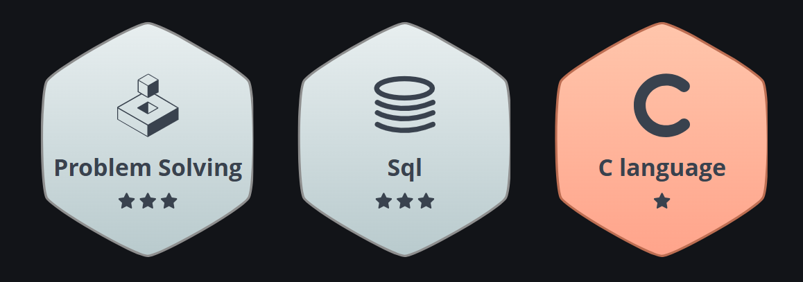

<!-- ========================================================= -->
<!--                  R U P A M   M O N D A L                  -->
<!-- ========================================================= -->

<!-- Animated Wave Banner -->

  

<!-- Typing Intro -->

  

<!-- Neon Stat Badges -->

  
  
  
  

---

<!-- ===================== ABOUT ME ===================== -->

  

<table>
  <tr>
    <td valign="top" width="60%">

Hi, I'm **Rupam Mondal** — a data-first problem solver who turns messy information into reliable intelligence and ML-powered experiences.

- 🔭 Translate business questions into analytics, predictive models, and human-friendly AI copilots
- ⚙️ Build end-to-end pipelines covering ingestion, data quality, feature design, and deployment
- 🤖 Experimenting with LLM tooling, retrieval workflows, and lightweight MLOps automation
- 📈 Blend statistics, experimentation, and storytelling so decisions are auditable and trusted
- 🚀 Excited to ship measurable, data-driven products with collaborative product teams

    </td>
    <td valign="top" width="40%">

**Quick Snapshot**

- 🧭 Strengths: analytical storytelling, reproducible workflows, collaborative mindset  
- 🛠 Favorite stack: Python, SQL, Power BI/Tableau, scikit-learn, TensorFlow  
- 🌍 Based in **India** 🇮🇳  
- 💼 Open to data, ML, and AI roles (remote or hybrid)  
- 🤝 Happy to partner on research-backed builds and hackathon ideas  

    </td>
  </tr>
</table>

---

<!-- ===================== TECH STACK ===================== -->

  

###  **Programming & Scripting**

###  **Databases**

###  **Data Engineering and Warehousing**

###  **Data Analysis and Business Intelligence**
  
  
  
  

###  **Machine Learning & AI**

- Data Cleaning & Preprocessing  
- Exploratory Data Analysis (EDA)  
- Supervised & Unsupervised ML  
- Regression, Classification, Clustering  
- Model Evaluation, Tuning & Cross-Validation  
- Intro-level Deep Learning & NLP  

###  **Dev Tools & Platforms**

  
  

### **Cloud Platforms**

---

<!-- ===================== PROBLEM SOLVING ===================== -->

  

  

    

      

        

          <h3 style="text-align:center;margin-top:0;margin-bottom:16px;font-weight:600;letter-spacing:0.4px;">LeetCode Highlights</h3>
          
          

            .
          

        

        

          <h3 style="text-align:center;margin-top:0;margin-bottom:16px;font-weight:600;letter-spacing:0.4px;">HackerRank Profile</h3>
          
          

            
          

        

      

    

  

---

  

  

    

    

      
      
    

     
    

      
    

     
    

      
    

  

<!-- ===================== CONTRIBUTION SNAKE (NEON CARD) ===================== -->

  

  

  

  

        
  

  

---

<!-- ===================== FEATURED PROJECTS ===================== -->

  

> 🧩 Replace with your real repos – these are **structure templates** to make your portfolio recruiter-friendly.

### 🩺 Cardiovascular Disease Prediction (ML)

- 🧠 Built ML model to predict heart disease risk from clinical features  
- 🧹 Performed EDA, feature engineering and model evaluation  
- 🛠 `Python • Scikit-Learn • Pandas • Matplotlib`  
- 🔗 **Repo:** _add link here_

---

### 📉 Customer Churn Prediction

- 🔍 End-to-end pipeline to identify customers likely to churn  
- 🧮 Used metrics like ROC-AUC, precision/recall and confusion matrix  
- 🛠 `Python • Sklearn • SQL • Visualization`  
- 🔗 **Repo:** _add link here_

---

### 📊 Data Analytics Dashboard (Power BI / Tableau)

- 📈 Created interactive dashboards for KPIs, revenue trends and regions  
- 📊 Designed user-friendly visuals for non-technical stakeholders  
- 🛠 `Power BI / Tableau • Excel • SQL`  
- 🔗 **Dashboard / Repo:** _add link here_

---

<!-- ===================== CERTIFICATIONS ===================== -->

  

  

> 🎓 Add your real certificates here. Example format:

- 🎓 **Google Data Analytics Professional Certificate** – Coursera (YYYY)  
- 🎓 **Machine Learning Specialization** – Platform (YYYY)  
- 🎓 **Python for Data Science** – Platform (YYYY)  

---

<!-- ===================== CONNECT WITH ME ===================== -->

  

  
  &nbsp;
  
  &nbsp;
  
  &nbsp;
  
  &nbsp;
  

---

<!-- ===================== QUOTE ===================== -->

  

  <em>"Data is powerful — but only for those who know how to read it."</em>

