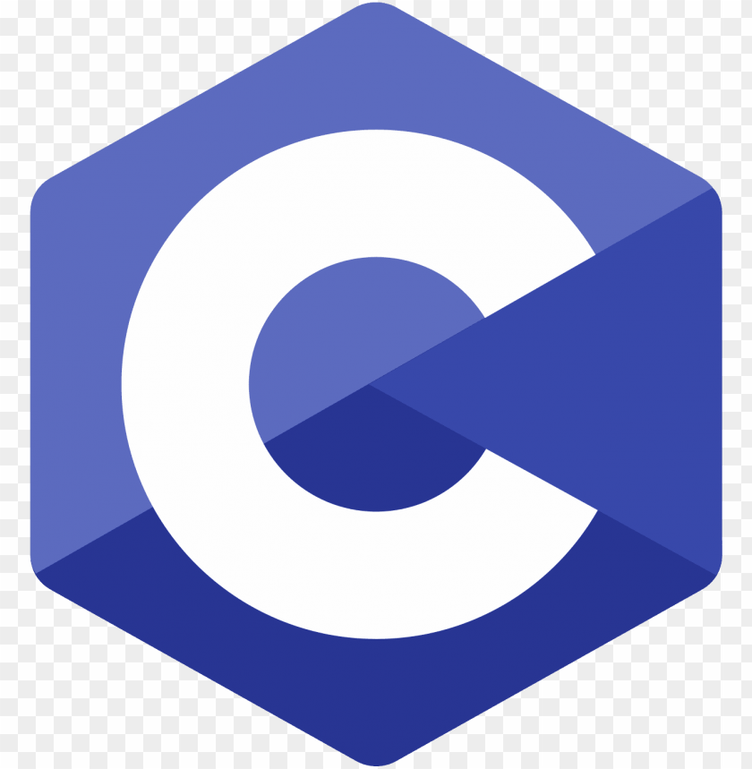
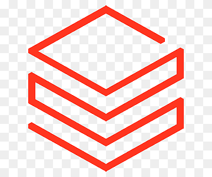
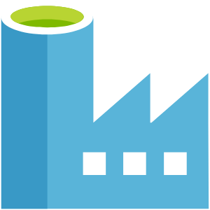
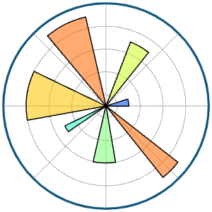
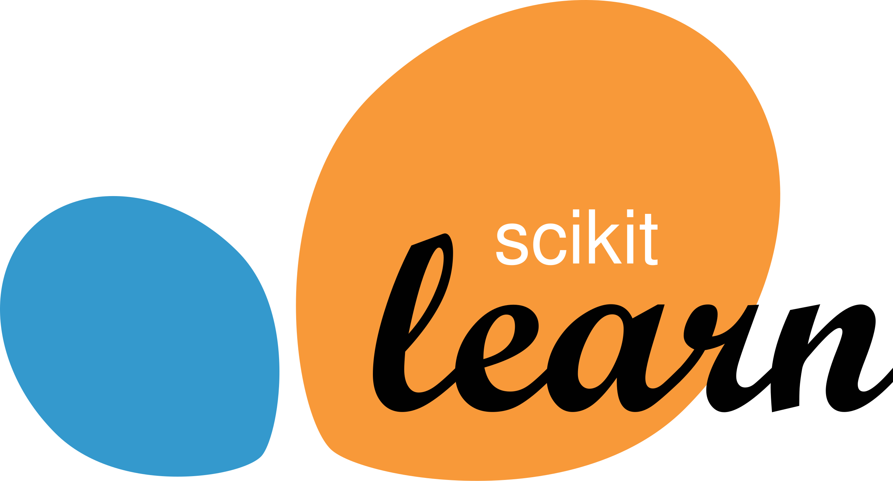
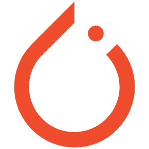
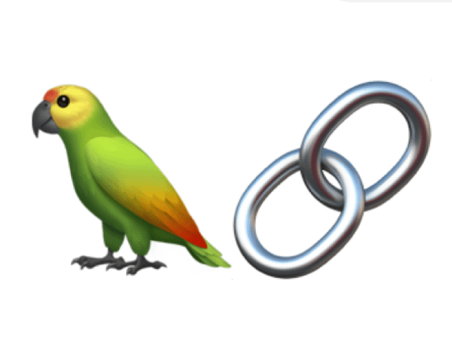
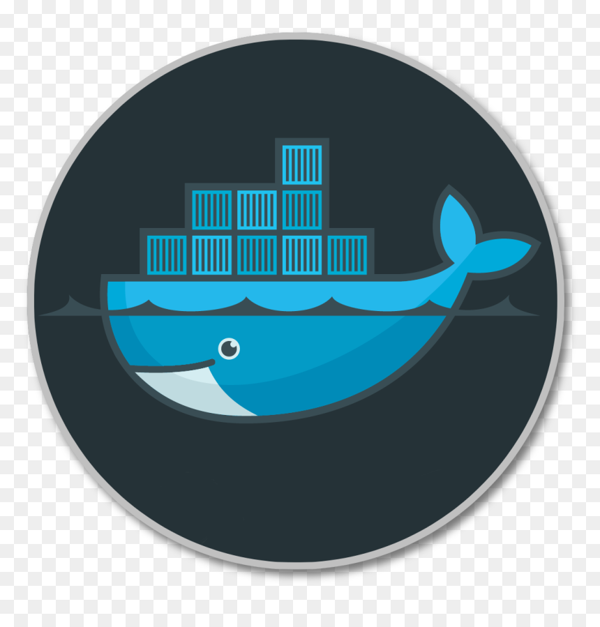

<!-- ========================================================= -->
<!--                  R U P A M   M O N D A L                  -->
<!-- ========================================================= -->

<!-- Animated Wave Banner -->

  

<!-- Typing Intro -->

  

<!-- Neon Stat Badges -->

  
  
  
  

---

<!-- ===================== ABOUT ME ===================== -->

  

  

    

      <table width="100%" cellpadding="0" cellspacing="0">
        <tr>
          <td valign="top" width="55%" style="padding-right:24px;">
            
I'm <strong>Rupam Mondal</strong>, a data-focused engineer building production-ready data pipelines, ML systems, and AI applications.

            
<strong>Focus:</strong> End-to-end analytics, ML workflows, healthcare prediction, and computer vision.

            
<strong>Looking for:</strong> Data Analyst / ML Engineer / AI Engineer roles to deliver scalable data & AI solutions with real impact.

          </td>
          <td valign="top" width="45%">
            <table width="100%" border="1" bordercolor="#27ffd9" cellpadding="10" cellspacing="0" style="background-color:#050d24;border-radius:14px;">
              <tr bgcolor="#0d1633">
                <th align="left" style="color:#27ffd9;">Education</th>
                <th align="left" style="color:#27ffd9;">Highlights</th>
              </tr>
              <tr bgcolor="#0b142b">
                <td style="color:#f4f8ff;">B.Tech CSE (AI & ML)</td>
                <td style="color:#9bb6ff;">University of Engineering and Management, Kolkata GPA 8.64 (till 6th sem) • 2022‑2026</td>
              </tr>
              <tr bgcolor="#0b142b">
                <td style="color:#f4f8ff;">Higher Secondary</td>
                <td style="color:#9bb6ff;">Sree Ramakrishna Sishutirtha High School Science • 81.8% • 2021‑2022</td>
              </tr>
              <tr bgcolor="#0b142b">
                <td style="color:#f4f8ff;">Secondary</td>
                <td style="color:#9bb6ff;">Patha Bhavan Dankuni 81.5% • 2020</td>
              </tr>
            </table>
          </td>
        </tr>
      </table>
    

  

---

<!-- ===================== TECH STACK (NEON CARD) ===================== -->

  

###  **Programming & Scripting**

  
  &nbsp;&nbsp;&nbsp;&nbsp;&nbsp;&nbsp;&nbsp;&nbsp;
  
  &nbsp;&nbsp;&nbsp;&nbsp;&nbsp;&nbsp;&nbsp;&nbsp;
  

---

###  **Databases**

  
  &nbsp;&nbsp;&nbsp;&nbsp;&nbsp;&nbsp;&nbsp;&nbsp;
  

---

###  **Data Engineering and Warehousing**

  
  &nbsp;&nbsp;&nbsp;&nbsp;&nbsp;&nbsp;&nbsp;&nbsp;
  
  &nbsp;&nbsp;&nbsp;&nbsp;&nbsp;&nbsp;&nbsp;&nbsp;
  
  &nbsp;&nbsp;&nbsp;&nbsp;&nbsp;&nbsp;&nbsp;&nbsp;
  
  &nbsp;&nbsp;&nbsp;&nbsp;&nbsp;&nbsp;&nbsp;&nbsp;
  

---

###  **Data Analysis and Business Intelligence**

  
  &nbsp;&nbsp;&nbsp;&nbsp;&nbsp;&nbsp;&nbsp;&nbsp;
  
  &nbsp;&nbsp;&nbsp;&nbsp;&nbsp;&nbsp;&nbsp;&nbsp;
  
  &nbsp;&nbsp;&nbsp;&nbsp;&nbsp;&nbsp;&nbsp;&nbsp;
  
  &nbsp;&nbsp;&nbsp;&nbsp;&nbsp;&nbsp;&nbsp;&nbsp;
  
  &nbsp;&nbsp;&nbsp;&nbsp;&nbsp;&nbsp;&nbsp;&nbsp;
  

---

###  **Machine Learning & AI**

  
  &nbsp;&nbsp;&nbsp;&nbsp;&nbsp;&nbsp;&nbsp;&nbsp;
  
  &nbsp;&nbsp;&nbsp;&nbsp;&nbsp;&nbsp;&nbsp;&nbsp;
  
  &nbsp;&nbsp;&nbsp;&nbsp;&nbsp;&nbsp;&nbsp;&nbsp;
  
  &nbsp;&nbsp;&nbsp;&nbsp;&nbsp;&nbsp;&nbsp;&nbsp;
  
  &nbsp;&nbsp;&nbsp;&nbsp;&nbsp;&nbsp;&nbsp;&nbsp;
  

---

###  **Dev Tools & Platforms**

  
  &nbsp;&nbsp;&nbsp;&nbsp;&nbsp;&nbsp;&nbsp;&nbsp;
  
  &nbsp;&nbsp;&nbsp;&nbsp;&nbsp;&nbsp;&nbsp;&nbsp;
  
  &nbsp;&nbsp;&nbsp;&nbsp;&nbsp;&nbsp;&nbsp;&nbsp;
  
  &nbsp;&nbsp;&nbsp;&nbsp;&nbsp;&nbsp;&nbsp;&nbsp;
  
  &nbsp;&nbsp;&nbsp;&nbsp;&nbsp;&nbsp;&nbsp;&nbsp;
  
  &nbsp;&nbsp;&nbsp;&nbsp;&nbsp;&nbsp;&nbsp;&nbsp;
  
  &nbsp;&nbsp;&nbsp;&nbsp;&nbsp;&nbsp;&nbsp;&nbsp;
  

---

### **Cloud Platforms**

  
  &nbsp;&nbsp;&nbsp;&nbsp;&nbsp;&nbsp;&nbsp;&nbsp;
  

***

<!-- ===================== PROBLEM SOLVING ===================== -->

  

  <table>
    <tr>
      <td width="50%" align="center">
        <h3>LeetCode Highlights</h3>
        
      </td>
      <td width="50%" align="center">
        <h3>HackerRank Profile</h3>
        
          
        
      </td>
    </tr>
  </table>

---

  

  <table>
    <tr>
      <td width="50%">
        
      </td>
      <td width="50%">
        
      </td>
    </tr>
    <tr>
      <td width="50%">
        
      </td>
      <td width="50%">
        
      </td>
    </tr>
  </table>

<table align="center">
  <tr>
    <td align="center">

    </td>
  </tr>
</table>

---

<!-- ===================== CONTRIBUTION SNAKE (NEON CARD) ===================== -->

  

  

  

  

        
  

  

---

<!-- ===================== FEATURED PROJECTS ===================== -->

  

###  **Swiggy Sales Analysis ( SQL+Tableau )**

- 🧠 End-to-end data analysis of Swiggy sales using SQL Server with Star Schema modeling

- 🧹 Data cleaning & validation (NULL checks,Empty String check, Remove duplicates)

- 📈 dimensional modeling with **1 Fact table** and **5 Dimension tables**
    - `Fact_Order`: contains measures like `price_INR`, `rating`, `rating_count`
    - `Dim_Date`: temporal attributes (year, month, quarter)
    - `Dim_Location`: geography (state, city, location)
    - `Dim_Restaurant`: restaurant master
    - `Dim_Catagory`: category master
    - `Dim_Dish`: dish master

- 📊 KPIs: Total Revenue, AOV, MoM/QoQ Growth, Top/Bottom cities, Restaurant performance metrics

- 🔎 Business insights: City expansion potential, restaurant dependency, pricing analysis, weekday vs weekend trends

- 🛠 `SQL Server • T-SQL • Star Schema • Window Functions • CTE`

- 🔗 **Repo:** **[Link](https://github.com/RpM-999/SQL-P1-SWIGGY_SALES_ANALYSIS)**

---

###  **Heart Disease Prediction ( ML )**

- 🧠 Predicts heart disease risk with confidence score using trained ML model

- 🧹 Full pipeline: Data cleaning → Preprocessing → Model training → Streamlit app → Deployment

- 📊 Model comparison: Logistic Regression (87%) vs **Random Forest (100% accuracy)** — RF chosen for deployment

- 🎯 Features: Real-time prediction, risk level categories (Low/Moderate/High), dark mode UI

- 🛠 `Python • Scikit-Learn • Pandas • Matplotlib • Seaborn • Streamlit`

- 🌐 **Live Demo:** **[Try the App](https://heart-disease-predictor-999.streamlit.app/)**

- 🔗 **Repo:** **[Link](https://github.com/RpM-999/P1-Heart-Disease-Predictor)**

---

### **Facial Recognition Based Attendance Management System( AI-System )**

- 🧠 A comprehensive student attendance management system that leverages facial recognition technology to automate student attendance tracking.   

- 🧹 **Student Form for registration**

    - student will fill his/her personal information and student face images 

    - student informations and enbeddings of students faces are temporarily stored in Google sheet

- 🧹**Admin Panel**

    - admin can control the opening and cloasing of the student registration form , after filling up the form by all the students admin push the student informations *(which are temporarily stored in google sheet)* in database personal informations are stored in the *supabase(RDB)* and embedding are stored inside *Qdrant(VDB)* , during pushing information student get their enrollment number in thier email *(which they give during fill up the form)*

    - admin can create new depaertment(dep_id,dep_name,dep_hod_name,dep_hod_mail) , update department information

    - admin can select duration(*1-month*) and department , during this duration student attendence list with %-of attendence of each student will send to the respective HOD's mail 

- 🧹**Give Attendence**

    - student stand infront of camera it autometically detect face after that generate embedding and search *(semantic searching : cosine similarity)* in Qdrant database and and show the Student name , deparment name of the closest similer embedding if the student press 'confirm' button then his/he attendence will be recorded , if *(face not recognized / other students information retrived)* then student should press cancel button and contact with the admin(technical team of college)

- 🛠 `Python • Pytorch • Supabase(RDB) • Qdrant(VDB) • Google Sheet • Streamlit`  
- 🔗 **Repo:** **[Link](https://github.com/RpM-999/P14-Facial-Recognition-Based-Attendance-System)**
---

<!-- ===================== CERTIFICATIONS ===================== -->

  

  

    

      <table width="100%" cellpadding="12" cellspacing="0" style="border-collapse:collapse;">
        <tr bgcolor="#0d1633">
          <th align="left" style="color:#27ffd9;">Badge</th>
          <th align="left" style="color:#27ffd9;">Certification</th>
          <th align="left" style="color:#27ffd9;">Platform</th>
          <th align="left" style="color:#27ffd9;">Year</th>
          <th align="left" style="color:#27ffd9;">Proof</th>
        </tr>
        <tr bgcolor="#0b142b">
          <td width="90" align="center"></td>
          <td style="color:#f4f8ff;">Snowflake Data Warehouse</td>
          <td style="color:#9bb6ff;">Snowflake</td>
          <td style="color:#9bb6ff;">2025</td>
          <td><a href="https://achieve.snowflake.com/be0b82d3-f0c2-4300-868c-328830702505#acc.aA2Hyc8j" style="color:#27ffd9;">Link</a></td>
        </tr>
        <tr bgcolor="#0b142b">
          <td width="90" align="center"></td>
          <td style="color:#f4f8ff;">Google Advanced Data Analytics Professional Certificate</td>
          <td style="color:#9bb6ff;">Coursera</td>
          <td style="color:#9bb6ff;">2025</td>
          <td><a href="https://www.coursera.org/account/accomplishments/professional-cert/EAL2FKU5BBI3" style="color:#27ffd9;">Link</a></td>
        </tr>
        </tr>
        <tr bgcolor="#0b142b">
          <td width="90" align="center"></td>
          <td style="color:#f4f8ff;">Advanced Tableau</td>
          <td style="color:#9bb6ff;">Corporate Finance Institute</td>
          <td style="color:#9bb6ff;">2025</td>
          <td><a href="https://www.coursera.org/account/accomplishments/verify/W4SCVL7PXD34" style="color:#27ffd9;">Link</a></td>
        </tr>
        <tr bgcolor="#0b142b">
          <td width="90" align="center"></td>
          <td style="color:#f4f8ff;">Deep Learning Specialization</td>
          <td style="color:#9bb6ff;">Coursera</td>
          <td style="color:#9bb6ff;">2025</td>
          <td><a href="https://www.coursera.org/account/accomplishments/specialization/HNFI2WGW6I8O" style="color:#27ffd9;">Link</a></td>
        </tr>
        <tr bgcolor="#0b142b">
          <td width="90" align="center"></td>
          <td style="color:#f4f8ff;">Artificial Intelligence Fundamentals</td>
          <td style="color:#9bb6ff;">IBM</td>
          <td style="color:#9bb6ff;">2025</td>
          <td><a href="https://www.credly.com/badges/0e61d6e1-c5d2-43da-a37f-00cfacd2d0ba/public_url" style="color:#27ffd9;">Link</a></td>
        </tr>
        <tr bgcolor="#0b142b">
          <td width="90" align="center"></td>
          <td style="color:#f4f8ff;">Fandamentals of Agents</td>
          <td style="color:#9bb6ff;">Hugging Face</td>
          <td style="color:#9bb6ff;">2025</td>
          <td><a href="#" style="color:#27ffd9;">coming soon</a></td>
        </tr>
      </table>
    

  

---

<!-- ===================== CONNECT WITH ME ===================== -->

  

  
  &nbsp;&nbsp;&nbsp;&nbsp;&nbsp;&nbsp;&nbsp;&nbsp;&nbsp;&nbsp;&nbsp;&nbsp;&nbsp;&nbsp;&nbsp;&nbsp;&nbsp;&nbsp;&nbsp;&nbsp;
  
  &nbsp;&nbsp;&nbsp;&nbsp;&nbsp;&nbsp;&nbsp;&nbsp;&nbsp;&nbsp;&nbsp;&nbsp;&nbsp;&nbsp;&nbsp;&nbsp;&nbsp;&nbsp;&nbsp;&nbsp;
  
  &nbsp;&nbsp;&nbsp;&nbsp;&nbsp;&nbsp;&nbsp;&nbsp;&nbsp;&nbsp;&nbsp;&nbsp;&nbsp;&nbsp;&nbsp;&nbsp;&nbsp;&nbsp;&nbsp;&nbsp;
  

---

<!-- ===================== QUOTE ===================== -->

  

  <em>"Data is powerful — but only for those who know how to read it."</em>

